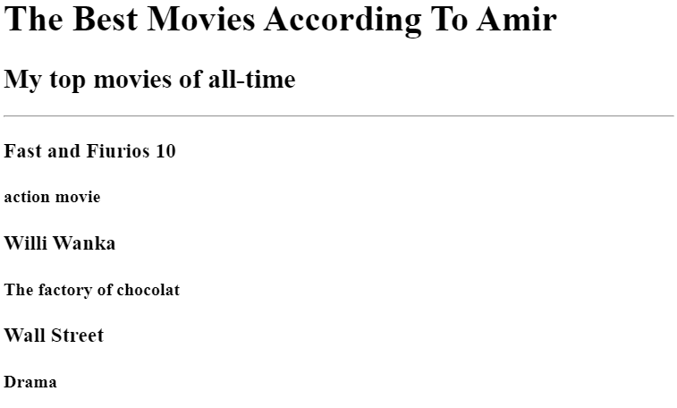
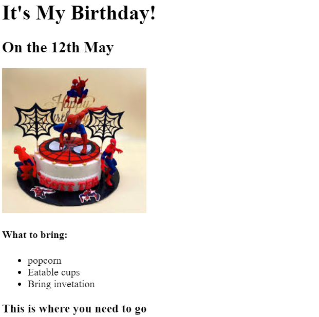

<!DOCTYPE html>
<html lang="en">
<head>
    <meta charset="UTF-8">
    <meta name="viewport" content="width=device-width, initial-scale=1.0">
    <title>Protfolio</title>
</head>
<body>
    <h1>Amir Protfolio</h1>
    <h2>I'm a Web Developer</h2>
    

    <h2>
        <a href="./movies.md">
            Movie Ranking Project
        </a>
    </h2>
    <h2>The Best Movie according to Amir</h2>
    <h3>My Top 3 Movies of all time.</h3>
    

    
    

    <h2>
        <a href="./BirthDay.md">Birth Day Project.</a>
    </h2>
    
    

    <a href="./Contact Me.md">Contact Me</a>
    <a href="./About Me.md">About Me</a>
</body>
</html>

